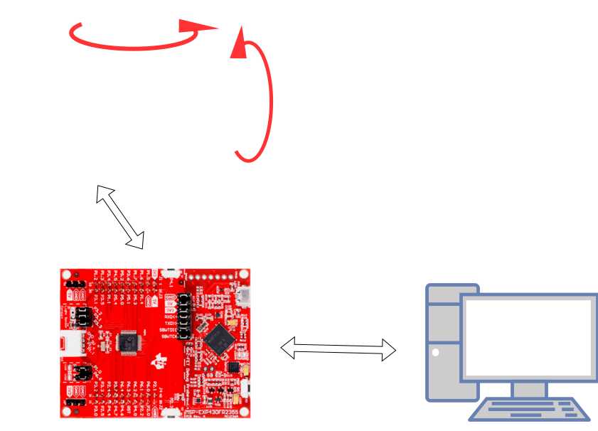
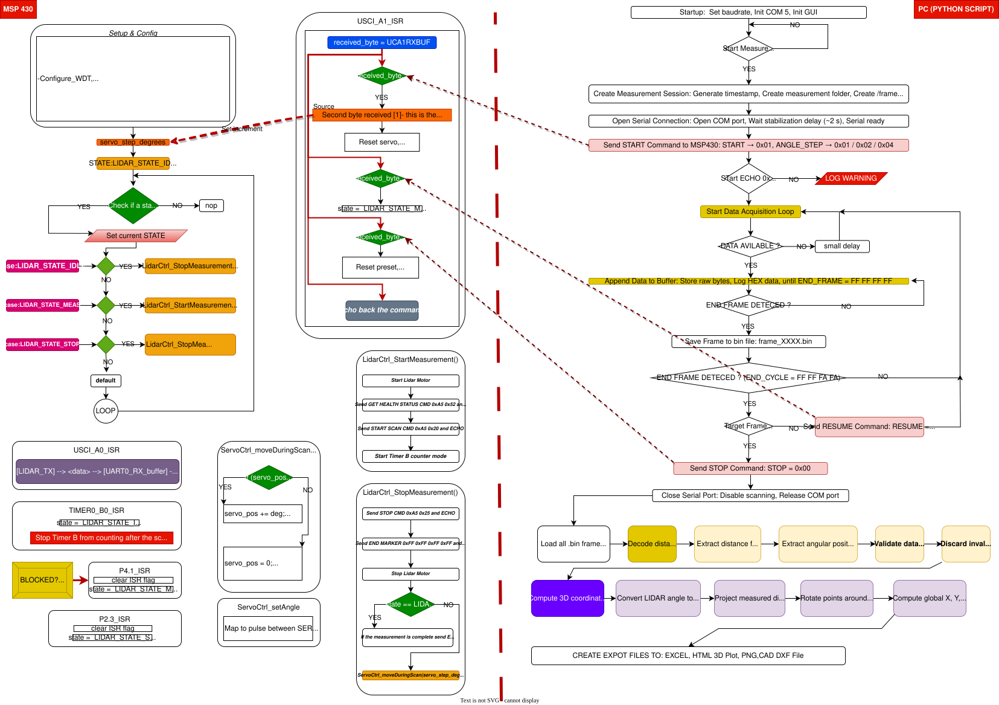
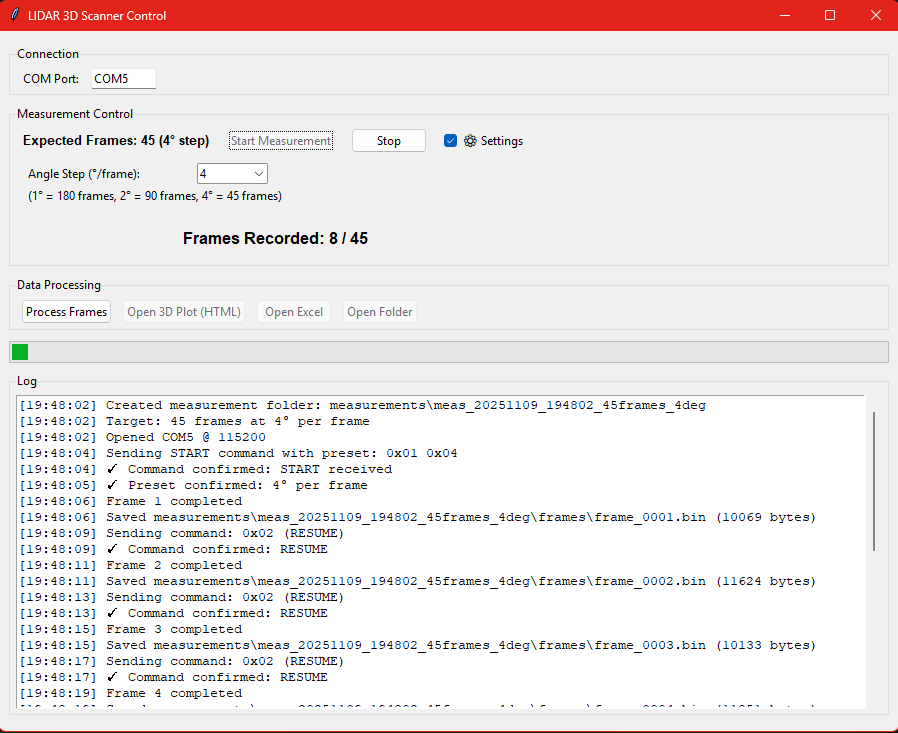
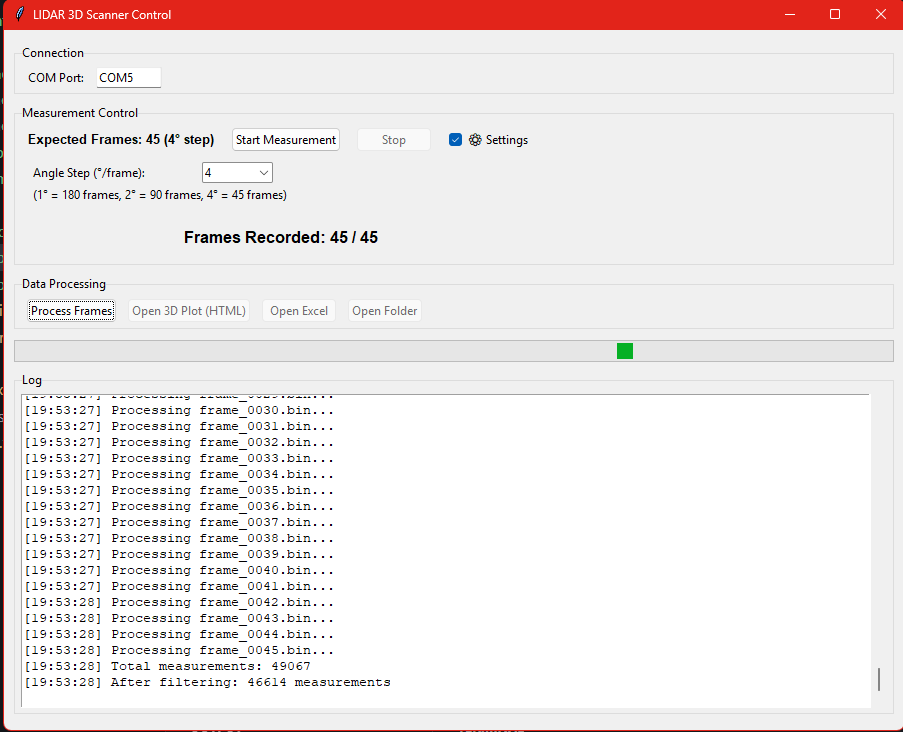
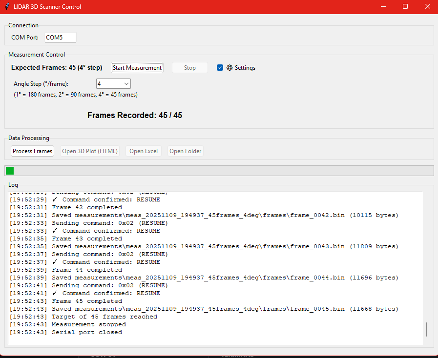
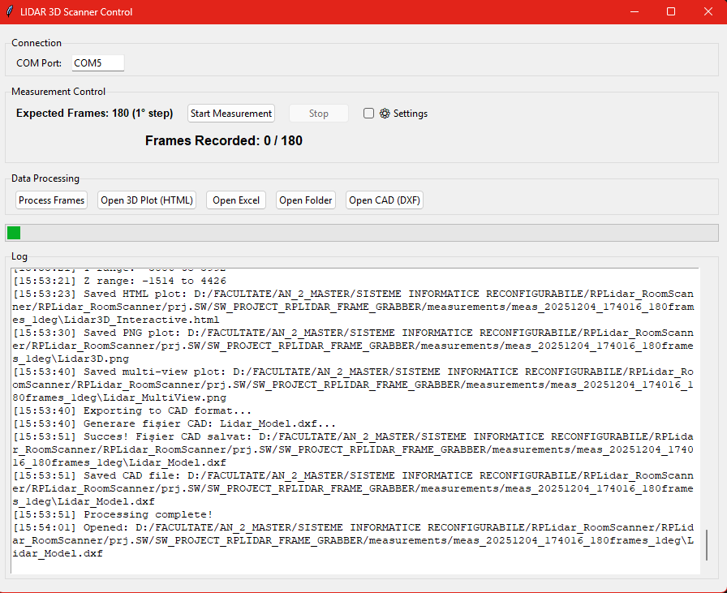
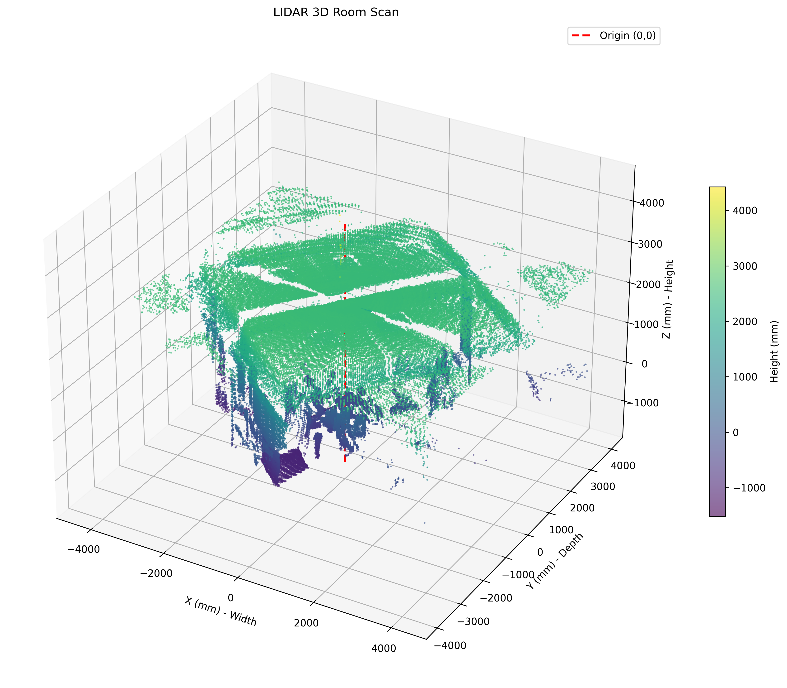
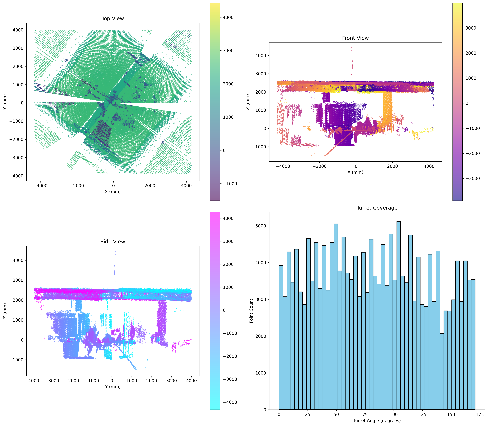

# RPLidar_RoomScanner
3D room scanner using MSP430, servo turret, RP Lidar and python aplication with GUI.
The system performs **step-by-step angular scanning**, captures raw LIDAR frames, decode the data received, and exports the result in multiple engineering-friendly formats 2D or 3D.

## 📌 Project Overview

This project implements a **3D radar-like scanning system** with the following characteristics:

- Rotating turret controlled by MSP430
- 2D LIDAR mounted on the rotating platform
- PC ↔ MSP430 serial communication
- Raw binary frame capture
- Offline decoding and 3D reconstruction
- Visualization and CAD export

## 🖥️ Software Architecture

The software is split into **two layers**:

- **Embedded Layer (MSP430)**  
  Handles real-time control, motor stepping, and raw LIDAR data streaming.

- **PC Application Layer (Python)**  
  Responsible for frame acquisition, decoding, 3D reconstruction, filtering, and visualization.

## 🔌 Communication Protocol (PC ↔ MSP430)

### Command Bytes (PC → MSP430)

| Command | Hex | Description |
|------|-----|------------|
| STOP | `0x00` | Stop scanning |
| START | `0x01` | Start scanning |
| RESUME | `0x02` | Continue to next angle |

### Angle Preset (after START)

| Angle Step | Hex |
|----------|-----|
| 1° | `0x01` |
| 2° | `0x02` |
| 4° | `0x04` |

### Frame Markers (MSP430 → PC)

| Marker | Hex Sequence | Meaning |
|------|-------------|--------|
| End of Frame | `FF FF FF FF` | One LIDAR frame completed |
| End of Scan | `FF FF FA FA` | Full scan cycle finished |

## 🔄 Measurement Workflow

1. User starts measurement from GUI
2. PC sends `START` + angle preset to MSP430
3. MSP430 rotates turret and streams LIDAR data
4. PC buffers incoming bytes
5. Frame boundaries detected via end markers
6. Raw frames saved as binary files
7. PC sends `RESUME` for next angle step
8. Process repeats until scan completion

---

## 📐 Data Processing Pipeline

### Decode Distance & Angle
- Extract distance from raw LIDAR packets (Q2 format)
- Extract angular position (Q6 format)
- Validate using protocol check bits and quality flags
- Discard invalid or out-of-range measurements

### Compute 3D Coordinates
- Convert LIDAR angle to radians
- Convert turret rotation angle to radians
- Project distance into the scan plane
- Rotate points around the vertical axis (turret angle)
- Compute global **X, Y, Z** Cartesian coordinates

---

## 🧭 Application Workflow

The following screenshots illustrate the = application workflow.

<table>
  <tr>
    <td align="center">
       
      <b>Live Measurement</b>
    </td>
    <td align="center">
       
      <b>Processing Frames</b>
    </td>
  </tr>
  <tr>
    <td align="center">
       
      <b>Measurement Completed</b>
    </td>
    <td align="center">
       
      <b>Processing Completed</b>
    </td>
  </tr>
</table>

---

## 📊 Experimental Results

### 3D Reconstruction – Interactive View
: [link](prj.SW/SW_PROJECT_RPLIDAR_FRAME_GRABBER/measurements/meas_20251204_174016_180frames_1deg/Lidar3D_Interactive.html)

### 3D Reconstruction – Static View

### CAD Export (DXF)

